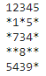
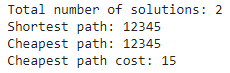

# Maze Solver

This maze-solver implements the recursive Depth First Search algorithm in C++ so that we can find all paths to the exit of our maze. A depth first search follows each path as deeply as it can before considering alternate routes. 

# Concept

Use recursion to implement the DFS algorithm which will find and display the correct path through a maze with the following constraints:

1. The maze will be stored in a text file and it can by any rectangle size so the maze size cannot be hard-coded. The implementation will use dynamic memory allocation to read and store the maze in a 2D array.
2. The maze can be built with numbers between 1-9 which will be a valid path, and '*' which will represent a wall.
3. From each point in the maze you can move to the next cell horizontally or vertially as long as the next cell is not a wall.
4. The path may not contain any loops, meaning a cell may only be visted once in a path. 
5. We will always start at the top left position of the maze. 
6. The exit of the maze will be any cell on the right hand side of the maze. 

# Output

The output from the maze-solver program must display:

1. Total number of valid paths on the constraints listed above.
2. Shortest path, where the length is equal to the number of cells taken from start to finish of the maze.
3. Cheapest path, where cost is equal to the sum of the numbers in each cell of the path.
4. Cheapest path's cost.

# Example

There are only 2 solutions: 1->2->3->4->5, and 1->2->1->7->3->4->5->4->5.

1->2->3->4->5->4->3->7->1->2->3->4->5 is NOT a solution because this path loops.

For this maze, the program will output a result like this:

